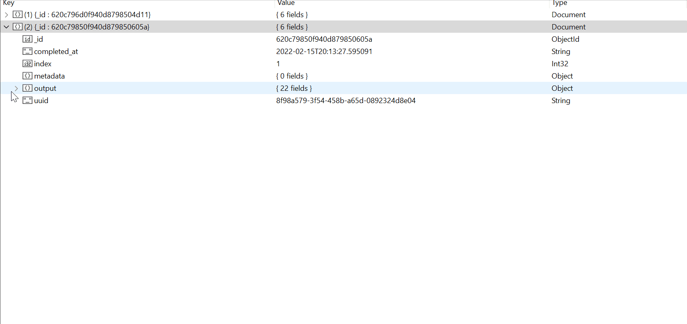

# QuAcc

[](https://codecov.io/gh/arosen93/quacc)
[](https://www.codefactor.io/repository/github/arosen93/quacc)
[](https://python.org/downloads)
[](https://pypi.org/project/quacc)

The Quantum Accelerator (QuAcc) supercharges your code to support high-throughput, database-driven computational materials science and quantum chemistry. Primarily, QuAcc seeks to enable a seamless interface between the [Atomic Simulation Environment](https://wiki.fysik.dtu.dk/ase/index.html) (ASE) and [Jobflow](https://github.com/materialsproject/jobflow) for rapid workflow development and prototyping while leveraging many of the tools that power the [Materials Project](https://materialsproject.org).

This package is heavily inspired by [Atomate2](https://github.com/materialsproject/atomate2), which I also recommend checking out.

**Disclaimer**: Currently, this package is under active development and should be considered *highly experimental.* User-friendly documentation will be provided once the code is in a more stable state.

## Examples
### VASP Job
```python
from ase.build import bulk
from jobflow.managers.local import run_locally

from quacc.recipes.vasp.core import RelaxJob as VaspRelaxJob

# Make a bulk Cu structure
atoms = bulk("Cu")

# Make a job consisting of a VASP relaxation using a pre-defined input set.
# By default, VASP will be run using Custodian for on-the-fly error handling.
job = VaspRelaxJob(preset="BulkSet").make(atoms)

# Run the job locally, with all output data stored in a convenient schema
responses = run_locally(job, create_folders=True)
```

### GFN2-xTB + Gaussian + ORCA Workflow with FireWorks
```python
from ase.build import molecule
from fireworks import LaunchPad
from jobflow import Flow
from jobflow.managers.fireworks import flow_to_workflow

from quacc.recipes.xtb.core import RelaxJob as XTBRelaxJob
from quacc.recipes.gaussian.core import RelaxJob as GaussianRelaxJob
from quacc.recipes.orca.core import StaticJob as OrcaStaticJob

# Make an H2 molecule
atoms = molecule("H2")

# Make a flow consisting of a GFN2-xTB relaxation followed by a Gaussian relaxation
# and then an ORCA static calculation
job1 = XTBRelaxJob(method="GFN2-xTB").make(atoms)
job2 = GaussianRelaxJob(xc="PBE").make(job1.output["atoms"])
job3 = OrcaStaticJob(xc="wB97M-V").make(job2.output["atoms"])

flow = Flow([job1, job2, job3])

# Instead of running locally, we will run the workflow via Fireworks here.
# The commands below convert the flow to a FireWorks workflow and adds it to
# the launchpad. Database-friendly results will be deposited in your JobFlow DB
wf = flow_to_workflow(flow)
lpad = LaunchPad.auto_load()
lpad.add_wf(wf)
```

### Database-Friendly Output
Assuming a Jobflow configuration file has been provided, the input and output data will be automagically tabulated and placed in your selected database. No custom parsing required. An example document is shown below:



## Installation
1. Run the following command, ideally in a fresh Python 3.10+ environment: `pip install quacc`. For the most recent development version, instead run `pip install git+https://github.com/arosen93/quacc.git`.

2. Follow the instructions in ASE's [documentation](https://wiki.fysik.dtu.dk/ase/ase/calculators/calculators.html#supported-calculators) for how to set up the ASE calculator(s) you plan to use.

3. Optional: Define the following environment variables (e.g. in your `~/.bashrc`) to use the database features of Jobflow and Fireworks, in addition to any that you have set in Step 2. Example `.yaml` files are provided [here](https://github.com/arosen93/quacc/tree/main/.config).

```bash
# Jobflow requirements
# (details: https://materialsproject.github.io/jobflow/jobflow.settings.html)
export JOBFLOW_CONFIG_FILE="/path/to/config/jobflow_config/jobflow.yaml"

# FireWorks requirements
# (details: https://materialsproject.github.io/fireworks)
export FW_CONFIG_FILE='/path/to/config/fw_config/FW_config.yaml'
```
## License
QuAcc is released under a [modified BSD license](https://github.com/arosen93/quacc/blob/main/LICENSE.md).
